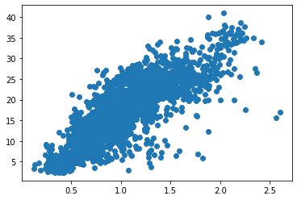
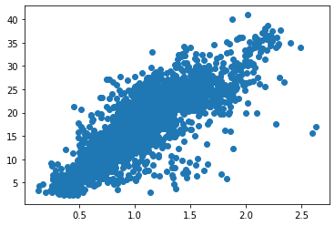
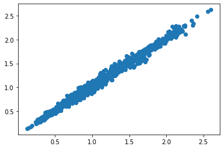
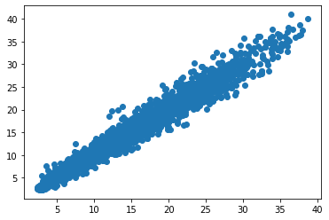
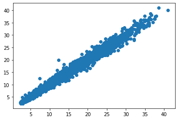
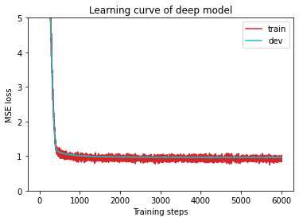

# **Homework 1: COVID-19 Cases Prediction (Regression)**

Author: Heng-Jui Chang

- Slides: https://github.com/ga642381/ML2021-Spring/blob/main/HW01/HW01.pdf  
- github https://github.com/wolfparticle/machineLearningDeepLearning 
- Video: https://www.bilibili.com/video/BV1zA411K7en?p=2

Objectives:
* Solve a regression problem with deep neural networks (DNN).
* Understand basic DNN training tips.
* Get familiar with PyTorch.

下面代码是基于作者baseline改的，主要改动有以下几方面：
 - 增加特征分析
 - 修改损失函数为均方根误差
 - 增加l2正则
 - 归一化方法
 - 修改一些超参
 - 增加部分代码注释

# **Import Some Packages**


```python
# PyTorch
import torch
import torch.nn as nn
from torch.utils.data import Dataset, DataLoader

# For data preprocess
import numpy as np
import csv
import os

# For plotting
import matplotlib.pyplot as plt
from matplotlib.pyplot import figure

#下面三个包是新增的
from sklearn.model_selection import train_test_split
import pandas as pd
import pprint as pp

myseed = 42069  # set a random seed for reproducibility
torch.backends.cudnn.deterministic = True
torch.backends.cudnn.benchmark = False
np.random.seed(myseed)
torch.manual_seed(myseed)
if torch.cuda.is_available():
    torch.cuda.manual_seed_all(myseed)
```

# **Download Data**
数据可以去[kaggle](https://www.kaggle.com/c/ml2021spring-hw1/data)下载, 不过我已经下载放到[github](https://github.com/wolfparticle/machineLearningDeepLearning),在/data/目录下


```python
tr_path = 'covid.train.csv'  # path to training data
tt_path = 'covid.test.csv'   # path to testing data
data_tr = pd.read_csv(tr_path) #读取训练数据
data_tt = pd.read_csv(tt_path) #读取测试数据
```

# **Data Analysis**
可视化数据，筛选有用特征


```python
data_tr.head(3) #数据量很大，看前三行就行，大致浏览下数据类型
```


<div>
<style scoped>
    .dataframe tbody tr th:only-of-type {
        vertical-align: middle;
    }

    .dataframe tbody tr th {
        vertical-align: top;
    }

    .dataframe thead th {
        text-align: right;
    }
</style>
<table border="1" class="dataframe">
  <thead>
    <tr style="text-align: right;">
      <th></th>
      <th>AL</th>
      <th>AK</th>
      <th>AZ</th>
      <th>AR</th>
      <th>CA</th>
      <th>CO</th>
      <th>CT</th>
      <th>FL</th>
      <th>GA</th>
      <th>ID</th>
      <th>...</th>
      <th>restaurant.2</th>
      <th>spent_time.2</th>
      <th>large_event.2</th>
      <th>public_transit.2</th>
      <th>anxious.2</th>
      <th>depressed.2</th>
      <th>felt_isolated.2</th>
      <th>worried_become_ill.2</th>
      <th>worried_finances.2</th>
      <th>tested_positive.2</th>
    </tr>
  </thead>
  <tbody>
    <tr>
      <th>0</th>
      <td>1.0</td>
      <td>0.0</td>
      <td>0.0</td>
      <td>0.0</td>
      <td>0.0</td>
      <td>0.0</td>
      <td>0.0</td>
      <td>0.0</td>
      <td>0.0</td>
      <td>0.0</td>
      <td>...</td>
      <td>23.812411</td>
      <td>43.430423</td>
      <td>16.151527</td>
      <td>1.602635</td>
      <td>15.409449</td>
      <td>12.088688</td>
      <td>16.702086</td>
      <td>53.991549</td>
      <td>43.604229</td>
      <td>20.704935</td>
    </tr>
    <tr>
      <th>1</th>
      <td>1.0</td>
      <td>0.0</td>
      <td>0.0</td>
      <td>0.0</td>
      <td>0.0</td>
      <td>0.0</td>
      <td>0.0</td>
      <td>0.0</td>
      <td>0.0</td>
      <td>0.0</td>
      <td>...</td>
      <td>23.682974</td>
      <td>43.196313</td>
      <td>16.123386</td>
      <td>1.641863</td>
      <td>15.230063</td>
      <td>11.809047</td>
      <td>16.506973</td>
      <td>54.185521</td>
      <td>42.665766</td>
      <td>21.292911</td>
    </tr>
    <tr>
      <th>2</th>
      <td>1.0</td>
      <td>0.0</td>
      <td>0.0</td>
      <td>0.0</td>
      <td>0.0</td>
      <td>0.0</td>
      <td>0.0</td>
      <td>0.0</td>
      <td>0.0</td>
      <td>0.0</td>
      <td>...</td>
      <td>23.593983</td>
      <td>43.362200</td>
      <td>16.159971</td>
      <td>1.677523</td>
      <td>15.717207</td>
      <td>12.355918</td>
      <td>16.273294</td>
      <td>53.637069</td>
      <td>42.972417</td>
      <td>21.166656</td>
    </tr>
  </tbody>
</table>
<p>3 rows × 94 columns</p>
</div>


```python
data_tt.head(3)
```


<div>
<style scoped>
    .dataframe tbody tr th:only-of-type {
        vertical-align: middle;
    }

    .dataframe tbody tr th {
        vertical-align: top;
    }

    .dataframe thead th {
        text-align: right;
    }
</style>
<table border="1" class="dataframe">
  <thead>
    <tr style="text-align: right;">
      <th></th>
      <th>id</th>
      <th>AL</th>
      <th>AK</th>
      <th>AZ</th>
      <th>AR</th>
      <th>CA</th>
      <th>CO</th>
      <th>CT</th>
      <th>FL</th>
      <th>GA</th>
      <th>...</th>
      <th>shop.2</th>
      <th>restaurant.2</th>
      <th>spent_time.2</th>
      <th>large_event.2</th>
      <th>public_transit.2</th>
      <th>anxious.2</th>
      <th>depressed.2</th>
      <th>felt_isolated.2</th>
      <th>worried_become_ill.2</th>
      <th>worried_finances.2</th>
    </tr>
  </thead>
  <tbody>
    <tr>
      <th>0</th>
      <td>0</td>
      <td>0.0</td>
      <td>0.0</td>
      <td>0.0</td>
      <td>0.0</td>
      <td>0.0</td>
      <td>1.0</td>
      <td>0.0</td>
      <td>0.0</td>
      <td>0.0</td>
      <td>...</td>
      <td>52.071090</td>
      <td>8.624001</td>
      <td>29.374792</td>
      <td>5.391413</td>
      <td>2.754804</td>
      <td>19.695098</td>
      <td>13.685645</td>
      <td>24.747837</td>
      <td>66.194950</td>
      <td>44.873473</td>
    </tr>
    <tr>
      <th>1</th>
      <td>1</td>
      <td>0.0</td>
      <td>0.0</td>
      <td>0.0</td>
      <td>0.0</td>
      <td>0.0</td>
      <td>0.0</td>
      <td>0.0</td>
      <td>0.0</td>
      <td>0.0</td>
      <td>...</td>
      <td>58.742461</td>
      <td>21.720187</td>
      <td>41.375784</td>
      <td>9.450179</td>
      <td>3.150088</td>
      <td>22.075715</td>
      <td>17.302077</td>
      <td>23.559622</td>
      <td>57.015009</td>
      <td>38.372829</td>
    </tr>
    <tr>
      <th>2</th>
      <td>2</td>
      <td>0.0</td>
      <td>0.0</td>
      <td>0.0</td>
      <td>0.0</td>
      <td>0.0</td>
      <td>0.0</td>
      <td>0.0</td>
      <td>0.0</td>
      <td>0.0</td>
      <td>...</td>
      <td>59.109045</td>
      <td>20.123959</td>
      <td>40.072556</td>
      <td>8.781522</td>
      <td>2.888209</td>
      <td>23.920870</td>
      <td>18.342506</td>
      <td>24.993341</td>
      <td>55.291498</td>
      <td>38.907257</td>
    </tr>
  </tbody>
</table>
<p>3 rows × 94 columns</p>
</div>


```python
data_tr.columns #查看有多少列特征
```


    Index(['id', 'AL', 'AK', 'AZ', 'AR', 'CA', 'CO', 'CT', 'FL', 'GA', 'ID', 'IL',
           'IN', 'IA', 'KS', 'KY', 'LA', 'MD', 'MA', 'MI', 'MN', 'MS', 'MO', 'NE',
           'NV', 'NJ', 'NM', 'NY', 'NC', 'OH', 'OK', 'OR', 'PA', 'RI', 'SC', 'TX',
           'UT', 'VA', 'WA', 'WV', 'WI', 'cli', 'ili', 'hh_cmnty_cli',
           'nohh_cmnty_cli', 'wearing_mask', 'travel_outside_state',
           'work_outside_home', 'shop', 'restaurant', 'spent_time', 'large_event',
           'public_transit', 'anxious', 'depressed', 'felt_isolated',
           'worried_become_ill', 'worried_finances', 'tested_positive', 'cli.1',
           'ili.1', 'hh_cmnty_cli.1', 'nohh_cmnty_cli.1', 'wearing_mask.1',
           'travel_outside_state.1', 'work_outside_home.1', 'shop.1',
           'restaurant.1', 'spent_time.1', 'large_event.1', 'public_transit.1',
           'anxious.1', 'depressed.1', 'felt_isolated.1', 'worried_become_ill.1',
           'worried_finances.1', 'tested_positive.1', 'cli.2', 'ili.2',
           'hh_cmnty_cli.2', 'nohh_cmnty_cli.2', 'wearing_mask.2',
           'travel_outside_state.2', 'work_outside_home.2', 'shop.2',
           'restaurant.2', 'spent_time.2', 'large_event.2', 'public_transit.2',
           'anxious.2', 'depressed.2', 'felt_isolated.2', 'worried_become_ill.2',
           'worried_finances.2', 'tested_positive.2'],
          dtype='object')


```python
data_tr.drop(['id'],axis = 1, inplace = True) #由于id列用不到，删除id列
data_tt.drop(['id'],axis = 1, inplace = True)
```


```python
cols = list(data_tr.columns)  #拿到特征列名称
pp.pprint(data_tr.columns)
```

    Index(['AL', 'AK', 'AZ', 'AR', 'CA', 'CO', 'CT', 'FL', 'GA', 'ID', 'IL', 'IN',
           'IA', 'KS', 'KY', 'LA', 'MD', 'MA', 'MI', 'MN', 'MS', 'MO', 'NE', 'NV',
           'NJ', 'NM', 'NY', 'NC', 'OH', 'OK', 'OR', 'PA', 'RI', 'SC', 'TX', 'UT',
           'VA', 'WA', 'WV', 'WI', 'cli', 'ili', 'hh_cmnty_cli', 'nohh_cmnty_cli',
           'wearing_mask', 'travel_outside_state', 'work_outside_home', 'shop',
           'restaurant', 'spent_time', 'large_event', 'public_transit', 'anxious',
           'depressed', 'felt_isolated', 'worried_become_ill', 'worried_finances',
           'tested_positive', 'cli.1', 'ili.1', 'hh_cmnty_cli.1',
           'nohh_cmnty_cli.1', 'wearing_mask.1', 'travel_outside_state.1',
           'work_outside_home.1', 'shop.1', 'restaurant.1', 'spent_time.1',
           'large_event.1', 'public_transit.1', 'anxious.1', 'depressed.1',
           'felt_isolated.1', 'worried_become_ill.1', 'worried_finances.1',
           'tested_positive.1', 'cli.2', 'ili.2', 'hh_cmnty_cli.2',
           'nohh_cmnty_cli.2', 'wearing_mask.2', 'travel_outside_state.2',
           'work_outside_home.2', 'shop.2', 'restaurant.2', 'spent_time.2',
           'large_event.2', 'public_transit.2', 'anxious.2', 'depressed.2',
           'felt_isolated.2', 'worried_become_ill.2', 'worried_finances.2',
           'tested_positive.2'],
          dtype='object')


```python
pp.pprint(data_tr.info()) #看每列数据类型和大小
```

    <class 'pandas.core.frame.DataFrame'>
    RangeIndex: 2700 entries, 0 to 2699
    Data columns (total 94 columns):
     #   Column                  Non-Null Count  Dtype  
    ---  ------                  --------------  -----  
     0   AL                      2700 non-null   float64
     1   AK                      2700 non-null   float64
     2   AZ                      2700 non-null   float64
     3   AR                      2700 non-null   float64
     4   CA                      2700 non-null   float64
     5   CO                      2700 non-null   float64
     6   CT                      2700 non-null   float64
     7   FL                      2700 non-null   float64
     8   GA                      2700 non-null   float64
     9   ID                      2700 non-null   float64
     10  IL                      2700 non-null   float64
     11  IN                      2700 non-null   float64
     12  IA                      2700 non-null   float64
     13  KS                      2700 non-null   float64
     14  KY                      2700 non-null   float64
     15  LA                      2700 non-null   float64
     16  MD                      2700 non-null   float64
     17  MA                      2700 non-null   float64
     18  MI                      2700 non-null   float64
     19  MN                      2700 non-null   float64
     20  MS                      2700 non-null   float64
     21  MO                      2700 non-null   float64
     22  NE                      2700 non-null   float64
     23  NV                      2700 non-null   float64
     24  NJ                      2700 non-null   float64
     25  NM                      2700 non-null   float64
     26  NY                      2700 non-null   float64
     27  NC                      2700 non-null   float64
     28  OH                      2700 non-null   float64
     29  OK                      2700 non-null   float64
     30  OR                      2700 non-null   float64
     31  PA                      2700 non-null   float64
     32  RI                      2700 non-null   float64
     33  SC                      2700 non-null   float64
     34  TX                      2700 non-null   float64
     35  UT                      2700 non-null   float64
     36  VA                      2700 non-null   float64
     37  WA                      2700 non-null   float64
     38  WV                      2700 non-null   float64
     39  WI                      2700 non-null   float64
     40  cli                     2700 non-null   float64
     41  ili                     2700 non-null   float64
     42  hh_cmnty_cli            2700 non-null   float64
     43  nohh_cmnty_cli          2700 non-null   float64
     44  wearing_mask            2700 non-null   float64
     45  travel_outside_state    2700 non-null   float64
     46  work_outside_home       2700 non-null   float64
     47  shop                    2700 non-null   float64
     48  restaurant              2700 non-null   float64
     49  spent_time              2700 non-null   float64
     50  large_event             2700 non-null   float64
     51  public_transit          2700 non-null   float64
     52  anxious                 2700 non-null   float64
     53  depressed               2700 non-null   float64
     54  felt_isolated           2700 non-null   float64
     55  worried_become_ill      2700 non-null   float64
     56  worried_finances        2700 non-null   float64
     57  tested_positive         2700 non-null   float64
     58  cli.1                   2700 non-null   float64
     59  ili.1                   2700 non-null   float64
     60  hh_cmnty_cli.1          2700 non-null   float64
     61  nohh_cmnty_cli.1        2700 non-null   float64
     62  wearing_mask.1          2700 non-null   float64
     63  travel_outside_state.1  2700 non-null   float64
     64  work_outside_home.1     2700 non-null   float64
     65  shop.1                  2700 non-null   float64
     66  restaurant.1            2700 non-null   float64
     67  spent_time.1            2700 non-null   float64
     68  large_event.1           2700 non-null   float64
     69  public_transit.1        2700 non-null   float64
     70  anxious.1               2700 non-null   float64
     71  depressed.1             2700 non-null   float64
     72  felt_isolated.1         2700 non-null   float64
     73  worried_become_ill.1    2700 non-null   float64
     74  worried_finances.1      2700 non-null   float64
     75  tested_positive.1       2700 non-null   float64
     76  cli.2                   2700 non-null   float64
     77  ili.2                   2700 non-null   float64
     78  hh_cmnty_cli.2          2700 non-null   float64
     79  nohh_cmnty_cli.2        2700 non-null   float64
     80  wearing_mask.2          2700 non-null   float64
     81  travel_outside_state.2  2700 non-null   float64
     82  work_outside_home.2     2700 non-null   float64
     83  shop.2                  2700 non-null   float64
     84  restaurant.2            2700 non-null   float64
     85  spent_time.2            2700 non-null   float64
     86  large_event.2           2700 non-null   float64
     87  public_transit.2        2700 non-null   float64
     88  anxious.2               2700 non-null   float64
     89  depressed.2             2700 non-null   float64
     90  felt_isolated.2         2700 non-null   float64
     91  worried_become_ill.2    2700 non-null   float64
     92  worried_finances.2      2700 non-null   float64
     93  tested_positive.2       2700 non-null   float64
    dtypes: float64(94)
    memory usage: 1.9 MB
    None


```python
WI_index = cols.index('WI')  # WI列是states one-hot编码最后一列，取值为0或1，后面特征分析时需要把states特征删掉
WI_index #wi列索引
```


    39


```python
data_tr.iloc[:, 40:].describe() #从上面可以看出wi 列后面是cli, 所以列索引从40开始， 并查看这些数据分布
```


<div>
<style scoped>
    .dataframe tbody tr th:only-of-type {
        vertical-align: middle;
    }

    .dataframe tbody tr th {
        vertical-align: top;
    }

    .dataframe thead th {
        text-align: right;
    }
</style>
<table border="1" class="dataframe">
  <thead>
    <tr style="text-align: right;">
      <th></th>
      <th>cli</th>
      <th>ili</th>
      <th>hh_cmnty_cli</th>
      <th>nohh_cmnty_cli</th>
      <th>wearing_mask</th>
      <th>travel_outside_state</th>
      <th>work_outside_home</th>
      <th>shop</th>
      <th>restaurant</th>
      <th>spent_time</th>
      <th>...</th>
      <th>restaurant.2</th>
      <th>spent_time.2</th>
      <th>large_event.2</th>
      <th>public_transit.2</th>
      <th>anxious.2</th>
      <th>depressed.2</th>
      <th>felt_isolated.2</th>
      <th>worried_become_ill.2</th>
      <th>worried_finances.2</th>
      <th>tested_positive.2</th>
    </tr>
  </thead>
  <tbody>
    <tr>
      <th>count</th>
      <td>2700.000000</td>
      <td>2700.000000</td>
      <td>2700.000000</td>
      <td>2700.000000</td>
      <td>2700.000000</td>
      <td>2700.000000</td>
      <td>2700.000000</td>
      <td>2700.000000</td>
      <td>2700.000000</td>
      <td>2700.000000</td>
      <td>...</td>
      <td>2700.000000</td>
      <td>2700.000000</td>
      <td>2700.000000</td>
      <td>2700.000000</td>
      <td>2700.000000</td>
      <td>2700.000000</td>
      <td>2700.000000</td>
      <td>2700.000000</td>
      <td>2700.000000</td>
      <td>2700.000000</td>
    </tr>
    <tr>
      <th>mean</th>
      <td>0.991587</td>
      <td>1.016136</td>
      <td>29.442496</td>
      <td>24.323054</td>
      <td>89.682322</td>
      <td>8.894498</td>
      <td>31.703307</td>
      <td>55.277153</td>
      <td>16.694342</td>
      <td>36.283177</td>
      <td>...</td>
      <td>16.578290</td>
      <td>36.074941</td>
      <td>10.257474</td>
      <td>2.385735</td>
      <td>18.067635</td>
      <td>13.058828</td>
      <td>19.243283</td>
      <td>64.834307</td>
      <td>44.568440</td>
      <td>16.431280</td>
    </tr>
    <tr>
      <th>std</th>
      <td>0.420296</td>
      <td>0.423629</td>
      <td>9.093738</td>
      <td>8.446750</td>
      <td>5.380027</td>
      <td>3.404027</td>
      <td>4.928902</td>
      <td>4.525917</td>
      <td>5.668479</td>
      <td>6.675206</td>
      <td>...</td>
      <td>5.651583</td>
      <td>6.655166</td>
      <td>4.686263</td>
      <td>1.053147</td>
      <td>2.250081</td>
      <td>1.628589</td>
      <td>2.708339</td>
      <td>6.220087</td>
      <td>5.232030</td>
      <td>7.619354</td>
    </tr>
    <tr>
      <th>min</th>
      <td>0.126321</td>
      <td>0.132470</td>
      <td>9.961640</td>
      <td>6.857181</td>
      <td>70.950912</td>
      <td>1.252983</td>
      <td>18.311941</td>
      <td>43.220187</td>
      <td>3.637414</td>
      <td>21.485815</td>
      <td>...</td>
      <td>3.637414</td>
      <td>21.485815</td>
      <td>2.118674</td>
      <td>0.728770</td>
      <td>12.980786</td>
      <td>8.370536</td>
      <td>13.400399</td>
      <td>48.225603</td>
      <td>33.113882</td>
      <td>2.338708</td>
    </tr>
    <tr>
      <th>25%</th>
      <td>0.673929</td>
      <td>0.697515</td>
      <td>23.203165</td>
      <td>18.539153</td>
      <td>86.309537</td>
      <td>6.177754</td>
      <td>28.247865</td>
      <td>51.547206</td>
      <td>13.311050</td>
      <td>30.740931</td>
      <td>...</td>
      <td>13.200532</td>
      <td>30.606711</td>
      <td>6.532543</td>
      <td>1.714080</td>
      <td>16.420485</td>
      <td>11.914167</td>
      <td>17.322912</td>
      <td>59.782876</td>
      <td>40.549987</td>
      <td>10.327314</td>
    </tr>
    <tr>
      <th>50%</th>
      <td>0.912747</td>
      <td>0.940295</td>
      <td>28.955738</td>
      <td>23.819761</td>
      <td>90.819435</td>
      <td>8.288288</td>
      <td>32.143140</td>
      <td>55.257262</td>
      <td>16.371699</td>
      <td>36.267966</td>
      <td>...</td>
      <td>16.227010</td>
      <td>36.041389</td>
      <td>9.700368</td>
      <td>2.199521</td>
      <td>17.684197</td>
      <td>12.948749</td>
      <td>18.760267</td>
      <td>65.932259</td>
      <td>43.997637</td>
      <td>15.646480</td>
    </tr>
    <tr>
      <th>75%</th>
      <td>1.266849</td>
      <td>1.302040</td>
      <td>36.109114</td>
      <td>30.238061</td>
      <td>93.937119</td>
      <td>11.582209</td>
      <td>35.387315</td>
      <td>58.866130</td>
      <td>21.396971</td>
      <td>41.659971</td>
      <td>...</td>
      <td>21.207162</td>
      <td>41.508520</td>
      <td>13.602566</td>
      <td>2.730469</td>
      <td>19.503419</td>
      <td>14.214320</td>
      <td>20.713638</td>
      <td>69.719651</td>
      <td>48.118283</td>
      <td>22.535165</td>
    </tr>
    <tr>
      <th>max</th>
      <td>2.597732</td>
      <td>2.625885</td>
      <td>56.832289</td>
      <td>51.550450</td>
      <td>98.087160</td>
      <td>18.552325</td>
      <td>42.359074</td>
      <td>65.673889</td>
      <td>28.488220</td>
      <td>50.606465</td>
      <td>...</td>
      <td>28.488220</td>
      <td>50.606465</td>
      <td>24.496711</td>
      <td>8.162275</td>
      <td>28.574091</td>
      <td>18.715944</td>
      <td>28.366270</td>
      <td>77.701014</td>
      <td>58.433600</td>
      <td>40.959495</td>
    </tr>
  </tbody>
</table>
<p>8 rows × 54 columns</p>
</div>


```python
data_tt.iloc[:, 40:].describe() #查看测试集数据分布，并和训练集数据分布对比，两者特征之间数据分布差异不是很大
```


<div>
<style scoped>
    .dataframe tbody tr th:only-of-type {
        vertical-align: middle;
    }

    .dataframe tbody tr th {
        vertical-align: top;
    }

    .dataframe thead th {
        text-align: right;
    }
</style>
<table border="1" class="dataframe">
  <thead>
    <tr style="text-align: right;">
      <th></th>
      <th>cli</th>
      <th>ili</th>
      <th>hh_cmnty_cli</th>
      <th>nohh_cmnty_cli</th>
      <th>wearing_mask</th>
      <th>travel_outside_state</th>
      <th>work_outside_home</th>
      <th>shop</th>
      <th>restaurant</th>
      <th>spent_time</th>
      <th>...</th>
      <th>shop.2</th>
      <th>restaurant.2</th>
      <th>spent_time.2</th>
      <th>large_event.2</th>
      <th>public_transit.2</th>
      <th>anxious.2</th>
      <th>depressed.2</th>
      <th>felt_isolated.2</th>
      <th>worried_become_ill.2</th>
      <th>worried_finances.2</th>
    </tr>
  </thead>
  <tbody>
    <tr>
      <th>count</th>
      <td>893.000000</td>
      <td>893.000000</td>
      <td>893.000000</td>
      <td>893.000000</td>
      <td>893.000000</td>
      <td>893.000000</td>
      <td>893.000000</td>
      <td>893.000000</td>
      <td>893.000000</td>
      <td>893.000000</td>
      <td>...</td>
      <td>893.000000</td>
      <td>893.000000</td>
      <td>893.000000</td>
      <td>893.000000</td>
      <td>893.000000</td>
      <td>893.000000</td>
      <td>893.000000</td>
      <td>893.000000</td>
      <td>893.000000</td>
      <td>893.000000</td>
    </tr>
    <tr>
      <th>mean</th>
      <td>0.972457</td>
      <td>0.991809</td>
      <td>29.075682</td>
      <td>24.018729</td>
      <td>89.637506</td>
      <td>9.001325</td>
      <td>31.620607</td>
      <td>55.422982</td>
      <td>16.554387</td>
      <td>36.371653</td>
      <td>...</td>
      <td>55.268628</td>
      <td>16.444916</td>
      <td>36.165898</td>
      <td>10.248975</td>
      <td>2.369115</td>
      <td>17.988147</td>
      <td>12.993830</td>
      <td>19.238723</td>
      <td>64.619920</td>
      <td>44.411505</td>
    </tr>
    <tr>
      <th>std</th>
      <td>0.411997</td>
      <td>0.415468</td>
      <td>9.596290</td>
      <td>8.988245</td>
      <td>4.733549</td>
      <td>3.655616</td>
      <td>4.754570</td>
      <td>4.366780</td>
      <td>5.688802</td>
      <td>6.203232</td>
      <td>...</td>
      <td>4.350540</td>
      <td>5.656828</td>
      <td>6.192274</td>
      <td>4.498845</td>
      <td>1.114366</td>
      <td>2.207022</td>
      <td>1.713143</td>
      <td>2.687435</td>
      <td>5.685865</td>
      <td>4.605268</td>
    </tr>
    <tr>
      <th>min</th>
      <td>0.139558</td>
      <td>0.159477</td>
      <td>9.171315</td>
      <td>6.014740</td>
      <td>76.895278</td>
      <td>2.062500</td>
      <td>18.299198</td>
      <td>44.062442</td>
      <td>3.800684</td>
      <td>21.487077</td>
      <td>...</td>
      <td>44.671891</td>
      <td>3.837441</td>
      <td>21.338425</td>
      <td>2.334655</td>
      <td>0.873986</td>
      <td>12.696977</td>
      <td>8.462444</td>
      <td>13.476209</td>
      <td>50.212234</td>
      <td>35.072577</td>
    </tr>
    <tr>
      <th>25%</th>
      <td>0.673327</td>
      <td>0.689367</td>
      <td>21.831730</td>
      <td>17.385490</td>
      <td>86.587475</td>
      <td>7.055039</td>
      <td>28.755178</td>
      <td>51.726987</td>
      <td>13.314242</td>
      <td>31.427591</td>
      <td>...</td>
      <td>51.594301</td>
      <td>13.391769</td>
      <td>31.330469</td>
      <td>6.802860</td>
      <td>1.760374</td>
      <td>16.406397</td>
      <td>11.777101</td>
      <td>17.197313</td>
      <td>60.358203</td>
      <td>40.910546</td>
    </tr>
    <tr>
      <th>50%</th>
      <td>0.925230</td>
      <td>0.936610</td>
      <td>28.183014</td>
      <td>23.035749</td>
      <td>90.123133</td>
      <td>8.773243</td>
      <td>31.826385</td>
      <td>55.750887</td>
      <td>17.100556</td>
      <td>36.692799</td>
      <td>...</td>
      <td>55.490325</td>
      <td>16.975410</td>
      <td>36.213594</td>
      <td>9.550393</td>
      <td>2.146468</td>
      <td>17.719760</td>
      <td>12.805424</td>
      <td>19.068658</td>
      <td>65.148128</td>
      <td>44.504010</td>
    </tr>
    <tr>
      <th>75%</th>
      <td>1.251219</td>
      <td>1.267463</td>
      <td>36.813772</td>
      <td>31.141866</td>
      <td>93.387952</td>
      <td>10.452262</td>
      <td>35.184926</td>
      <td>59.185350</td>
      <td>20.919961</td>
      <td>41.265159</td>
      <td>...</td>
      <td>59.078475</td>
      <td>20.584376</td>
      <td>41.071035</td>
      <td>13.372731</td>
      <td>2.645314</td>
      <td>19.423720</td>
      <td>14.091551</td>
      <td>21.205695</td>
      <td>68.994309</td>
      <td>47.172065</td>
    </tr>
    <tr>
      <th>max</th>
      <td>2.488967</td>
      <td>2.522263</td>
      <td>53.184067</td>
      <td>48.142433</td>
      <td>97.843221</td>
      <td>26.598752</td>
      <td>42.887263</td>
      <td>63.979007</td>
      <td>27.438286</td>
      <td>53.513289</td>
      <td>...</td>
      <td>63.771097</td>
      <td>27.362321</td>
      <td>52.045373</td>
      <td>23.305630</td>
      <td>9.118302</td>
      <td>27.003564</td>
      <td>18.964157</td>
      <td>26.007557</td>
      <td>76.871053</td>
      <td>56.442135</td>
    </tr>
  </tbody>
</table>
<p>8 rows × 53 columns</p>
</div>


```python
plt.scatter(data_tr.loc[:, 'cli'], data_tr.loc[:, 'tested_positive.2']) #肉眼分析cli特征与目标之间相关性
```


    <matplotlib.collections.PathCollection at 0x7f2d1f372ca0>


    

    


```python
plt.scatter(data_tr.loc[:, 'ili'], data_tr.loc[:, 'tested_positive.2'])
```


    <matplotlib.collections.PathCollection at 0x7f2d1f47fd90>


    

    


```python
plt.scatter(data_tr.loc[:, 'cli'], data_tr.loc[:, 'ili'])  #cli 和ili两者差不多，所以这两个特征用一个就行
```


    <matplotlib.collections.PathCollection at 0x7f2d1f39f9a0>


    

    


```python
plt.scatter(data_tr.loc[:,  'tested_positive'], data_tr.loc[:, 'tested_positive.2']) #day1 目标值与day3目标值相关性，线性相关的
```


    <matplotlib.collections.PathCollection at 0x7f2d0bbab5b0>


    

    


```python
plt.scatter(data_tr.loc[:,  'tested_positive.1'], data_tr.loc[:, 'tested_positive.2']) #day2 目标值与day3目标值相关性，线性相关的
```


    <matplotlib.collections.PathCollection at 0x7f2d1f31f1f0>


    

    


```python
data_tr.iloc[:, 40:].corr() #上面手动分析太累，还是利用corr方法自动分析
```


<div>
<style scoped>
    .dataframe tbody tr th:only-of-type {
        vertical-align: middle;
    }

    .dataframe tbody tr th {
        vertical-align: top;
    }

    .dataframe thead th {
        text-align: right;
    }
</style>
<table border="1" class="dataframe">
  <thead>
    <tr style="text-align: right;">
      <th></th>
      <th>cli</th>
      <th>ili</th>
      <th>hh_cmnty_cli</th>
      <th>nohh_cmnty_cli</th>
      <th>wearing_mask</th>
      <th>travel_outside_state</th>
      <th>work_outside_home</th>
      <th>shop</th>
      <th>restaurant</th>
      <th>spent_time</th>
      <th>...</th>
      <th>restaurant.2</th>
      <th>spent_time.2</th>
      <th>large_event.2</th>
      <th>public_transit.2</th>
      <th>anxious.2</th>
      <th>depressed.2</th>
      <th>felt_isolated.2</th>
      <th>worried_become_ill.2</th>
      <th>worried_finances.2</th>
      <th>tested_positive.2</th>
    </tr>
  </thead>
  <tbody>
    <tr>
      <th>cli</th>
      <td>1.000000</td>
      <td>0.995735</td>
      <td>0.893416</td>
      <td>0.882322</td>
      <td>-0.107406</td>
      <td>-0.095964</td>
      <td>0.087305</td>
      <td>-0.364165</td>
      <td>-0.143318</td>
      <td>-0.209020</td>
      <td>...</td>
      <td>-0.151291</td>
      <td>-0.222834</td>
      <td>-0.060308</td>
      <td>-0.374071</td>
      <td>0.237135</td>
      <td>0.081456</td>
      <td>0.098345</td>
      <td>0.228750</td>
      <td>0.550564</td>
      <td>0.838504</td>
    </tr>
    <tr>
      <th>ili</th>
      <td>0.995735</td>
      <td>1.000000</td>
      <td>0.889729</td>
      <td>0.878280</td>
      <td>-0.109015</td>
      <td>-0.106934</td>
      <td>0.086355</td>
      <td>-0.357443</td>
      <td>-0.142082</td>
      <td>-0.207210</td>
      <td>...</td>
      <td>-0.150141</td>
      <td>-0.220942</td>
      <td>-0.061298</td>
      <td>-0.363873</td>
      <td>0.245228</td>
      <td>0.086229</td>
      <td>0.104250</td>
      <td>0.222909</td>
      <td>0.544776</td>
      <td>0.830527</td>
    </tr>
    <tr>
      <th>hh_cmnty_cli</th>
      <td>0.893416</td>
      <td>0.889729</td>
      <td>1.000000</td>
      <td>0.997225</td>
      <td>-0.035441</td>
      <td>-0.069595</td>
      <td>0.079219</td>
      <td>-0.472746</td>
      <td>-0.247043</td>
      <td>-0.293775</td>
      <td>...</td>
      <td>-0.253615</td>
      <td>-0.300062</td>
      <td>-0.136937</td>
      <td>-0.433276</td>
      <td>0.307581</td>
      <td>0.181497</td>
      <td>0.203577</td>
      <td>0.350255</td>
      <td>0.561942</td>
      <td>0.879724</td>
    </tr>
    <tr>
      <th>nohh_cmnty_cli</th>
      <td>0.882322</td>
      <td>0.878280</td>
      <td>0.997225</td>
      <td>1.000000</td>
      <td>-0.046063</td>
      <td>-0.061914</td>
      <td>0.097756</td>
      <td>-0.465374</td>
      <td>-0.238106</td>
      <td>-0.280916</td>
      <td>...</td>
      <td>-0.245265</td>
      <td>-0.287482</td>
      <td>-0.129474</td>
      <td>-0.424996</td>
      <td>0.317836</td>
      <td>0.188467</td>
      <td>0.203599</td>
      <td>0.345448</td>
      <td>0.534711</td>
      <td>0.869938</td>
    </tr>
    <tr>
      <th>wearing_mask</th>
      <td>-0.107406</td>
      <td>-0.109015</td>
      <td>-0.035441</td>
      <td>-0.046063</td>
      <td>1.000000</td>
      <td>-0.220808</td>
      <td>-0.735649</td>
      <td>-0.691597</td>
      <td>-0.788714</td>
      <td>-0.807623</td>
      <td>...</td>
      <td>-0.785281</td>
      <td>-0.802659</td>
      <td>-0.889021</td>
      <td>0.133487</td>
      <td>0.204031</td>
      <td>-0.067720</td>
      <td>0.427533</td>
      <td>0.840528</td>
      <td>0.340101</td>
      <td>-0.069531</td>
    </tr>
    <tr>
      <th>travel_outside_state</th>
      <td>-0.095964</td>
      <td>-0.106934</td>
      <td>-0.069595</td>
      <td>-0.061914</td>
      <td>-0.220808</td>
      <td>1.000000</td>
      <td>0.264107</td>
      <td>0.256911</td>
      <td>0.288473</td>
      <td>0.349829</td>
      <td>...</td>
      <td>0.288098</td>
      <td>0.336937</td>
      <td>0.319736</td>
      <td>-0.203611</td>
      <td>0.001592</td>
      <td>0.064425</td>
      <td>-0.370776</td>
      <td>-0.131961</td>
      <td>-0.093096</td>
      <td>-0.097303</td>
    </tr>
    <tr>
      <th>work_outside_home</th>
      <td>0.087305</td>
      <td>0.086355</td>
      <td>0.079219</td>
      <td>0.097756</td>
      <td>-0.735649</td>
      <td>0.264107</td>
      <td>1.000000</td>
      <td>0.631958</td>
      <td>0.743673</td>
      <td>0.698047</td>
      <td>...</td>
      <td>0.730349</td>
      <td>0.705533</td>
      <td>0.758575</td>
      <td>-0.110176</td>
      <td>0.018259</td>
      <td>0.075562</td>
      <td>-0.430307</td>
      <td>-0.652231</td>
      <td>-0.317717</td>
      <td>0.034865</td>
    </tr>
    <tr>
      <th>shop</th>
      <td>-0.364165</td>
      <td>-0.357443</td>
      <td>-0.472746</td>
      <td>-0.465374</td>
      <td>-0.691597</td>
      <td>0.256911</td>
      <td>0.631958</td>
      <td>1.000000</td>
      <td>0.820916</td>
      <td>0.819035</td>
      <td>...</td>
      <td>0.811055</td>
      <td>0.838358</td>
      <td>0.787237</td>
      <td>0.130046</td>
      <td>-0.228007</td>
      <td>-0.029168</td>
      <td>-0.496368</td>
      <td>-0.866789</td>
      <td>-0.475304</td>
      <td>-0.410430</td>
    </tr>
    <tr>
      <th>restaurant</th>
      <td>-0.143318</td>
      <td>-0.142082</td>
      <td>-0.247043</td>
      <td>-0.238106</td>
      <td>-0.788714</td>
      <td>0.288473</td>
      <td>0.743673</td>
      <td>0.820916</td>
      <td>1.000000</td>
      <td>0.878576</td>
      <td>...</td>
      <td>0.993358</td>
      <td>0.876107</td>
      <td>0.909089</td>
      <td>-0.046081</td>
      <td>-0.278715</td>
      <td>-0.074727</td>
      <td>-0.648631</td>
      <td>-0.832131</td>
      <td>-0.430842</td>
      <td>-0.157945</td>
    </tr>
    <tr>
      <th>spent_time</th>
      <td>-0.209020</td>
      <td>-0.207210</td>
      <td>-0.293775</td>
      <td>-0.280916</td>
      <td>-0.807623</td>
      <td>0.349829</td>
      <td>0.698047</td>
      <td>0.819035</td>
      <td>0.878576</td>
      <td>1.000000</td>
      <td>...</td>
      <td>0.875365</td>
      <td>0.986713</td>
      <td>0.912682</td>
      <td>-0.040623</td>
      <td>-0.169965</td>
      <td>0.105281</td>
      <td>-0.517139</td>
      <td>-0.867460</td>
      <td>-0.522985</td>
      <td>-0.252125</td>
    </tr>
    <tr>
      <th>large_event</th>
      <td>-0.042033</td>
      <td>-0.043535</td>
      <td>-0.124151</td>
      <td>-0.116761</td>
      <td>-0.894970</td>
      <td>0.324270</td>
      <td>0.767305</td>
      <td>0.781862</td>
      <td>0.912449</td>
      <td>0.918504</td>
      <td>...</td>
      <td>0.910579</td>
      <td>0.913814</td>
      <td>0.993111</td>
      <td>-0.139139</td>
      <td>-0.215598</td>
      <td>0.055579</td>
      <td>-0.565014</td>
      <td>-0.874083</td>
      <td>-0.372589</td>
      <td>-0.052473</td>
    </tr>
    <tr>
      <th>public_transit</th>
      <td>-0.367103</td>
      <td>-0.356652</td>
      <td>-0.432142</td>
      <td>-0.423773</td>
      <td>0.131350</td>
      <td>-0.198308</td>
      <td>-0.110077</td>
      <td>0.132385</td>
      <td>-0.043954</td>
      <td>-0.037282</td>
      <td>...</td>
      <td>-0.048799</td>
      <td>-0.035965</td>
      <td>-0.137080</td>
      <td>0.982095</td>
      <td>-0.055799</td>
      <td>-0.167599</td>
      <td>0.001697</td>
      <td>-0.046611</td>
      <td>-0.138801</td>
      <td>-0.448360</td>
    </tr>
    <tr>
      <th>anxious</th>
      <td>0.273874</td>
      <td>0.281974</td>
      <td>0.336748</td>
      <td>0.344074</td>
      <td>0.232620</td>
      <td>-0.023175</td>
      <td>0.013537</td>
      <td>-0.265503</td>
      <td>-0.312912</td>
      <td>-0.209830</td>
      <td>...</td>
      <td>-0.327660</td>
      <td>-0.218920</td>
      <td>-0.283515</td>
      <td>-0.054270</td>
      <td>0.951196</td>
      <td>0.539596</td>
      <td>0.516252</td>
      <td>0.280087</td>
      <td>0.217988</td>
      <td>0.173295</td>
    </tr>
    <tr>
      <th>depressed</th>
      <td>0.098033</td>
      <td>0.102715</td>
      <td>0.184739</td>
      <td>0.190062</td>
      <td>-0.070022</td>
      <td>0.058548</td>
      <td>0.075801</td>
      <td>-0.041607</td>
      <td>-0.074059</td>
      <td>0.104628</td>
      <td>...</td>
      <td>-0.065903</td>
      <td>0.113934</td>
      <td>0.063086</td>
      <td>-0.165972</td>
      <td>0.599423</td>
      <td>0.953157</td>
      <td>0.592656</td>
      <td>-0.055694</td>
      <td>0.021274</td>
      <td>0.037689</td>
    </tr>
    <tr>
      <th>felt_isolated</th>
      <td>0.100928</td>
      <td>0.107079</td>
      <td>0.198176</td>
      <td>0.197661</td>
      <td>0.422058</td>
      <td>-0.376858</td>
      <td>-0.431247</td>
      <td>-0.491608</td>
      <td>-0.642316</td>
      <td>-0.511772</td>
      <td>...</td>
      <td>-0.633869</td>
      <td>-0.497951</td>
      <td>-0.544678</td>
      <td>0.009742</td>
      <td>0.526345</td>
      <td>0.604416</td>
      <td>0.978303</td>
      <td>0.395606</td>
      <td>0.128047</td>
      <td>0.082182</td>
    </tr>
    <tr>
      <th>worried_become_ill</th>
      <td>0.218502</td>
      <td>0.212931</td>
      <td>0.344457</td>
      <td>0.340192</td>
      <td>0.843990</td>
      <td>-0.136811</td>
      <td>-0.656085</td>
      <td>-0.864583</td>
      <td>-0.835101</td>
      <td>-0.870365</td>
      <td>...</td>
      <td>-0.831439</td>
      <td>-0.869933</td>
      <td>-0.872394</td>
      <td>-0.043575</td>
      <td>0.251045</td>
      <td>-0.038421</td>
      <td>0.419940</td>
      <td>0.992976</td>
      <td>0.490127</td>
      <td>0.262211</td>
    </tr>
    <tr>
      <th>worried_finances</th>
      <td>0.537608</td>
      <td>0.532217</td>
      <td>0.552431</td>
      <td>0.524022</td>
      <td>0.354130</td>
      <td>-0.096444</td>
      <td>-0.339975</td>
      <td>-0.489539</td>
      <td>-0.447892</td>
      <td>-0.536561</td>
      <td>...</td>
      <td>-0.451124</td>
      <td>-0.536959</td>
      <td>-0.397443</td>
      <td>-0.141140</td>
      <td>0.152500</td>
      <td>0.027382</td>
      <td>0.144230</td>
      <td>0.506907</td>
      <td>0.988123</td>
      <td>0.475462</td>
    </tr>
    <tr>
      <th>tested_positive</th>
      <td>0.839122</td>
      <td>0.829756</td>
      <td>0.880187</td>
      <td>0.869674</td>
      <td>-0.049350</td>
      <td>-0.113726</td>
      <td>0.025780</td>
      <td>-0.427815</td>
      <td>-0.173726</td>
      <td>-0.275476</td>
      <td>...</td>
      <td>-0.174815</td>
      <td>-0.278257</td>
      <td>-0.083275</td>
      <td>-0.451809</td>
      <td>0.132802</td>
      <td>0.021773</td>
      <td>0.090015</td>
      <td>0.285052</td>
      <td>0.495753</td>
      <td>0.981165</td>
    </tr>
    <tr>
      <th>cli.1</th>
      <td>0.980379</td>
      <td>0.977225</td>
      <td>0.887944</td>
      <td>0.877606</td>
      <td>-0.121569</td>
      <td>-0.091186</td>
      <td>0.096755</td>
      <td>-0.348133</td>
      <td>-0.129772</td>
      <td>-0.189519</td>
      <td>...</td>
      <td>-0.138355</td>
      <td>-0.204750</td>
      <td>-0.044520</td>
      <td>-0.369066</td>
      <td>0.254911</td>
      <td>0.088243</td>
      <td>0.093092</td>
      <td>0.212721</td>
      <td>0.540981</td>
      <td>0.838224</td>
    </tr>
    <tr>
      <th>ili.1</th>
      <td>0.976171</td>
      <td>0.980473</td>
      <td>0.884020</td>
      <td>0.873424</td>
      <td>-0.123680</td>
      <td>-0.102645</td>
      <td>0.096343</td>
      <td>-0.340973</td>
      <td>-0.128114</td>
      <td>-0.187173</td>
      <td>...</td>
      <td>-0.136904</td>
      <td>-0.202412</td>
      <td>-0.045430</td>
      <td>-0.358447</td>
      <td>0.263278</td>
      <td>0.092825</td>
      <td>0.099412</td>
      <td>0.206378</td>
      <td>0.534751</td>
      <td>0.829200</td>
    </tr>
    <tr>
      <th>hh_cmnty_cli.1</th>
      <td>0.896211</td>
      <td>0.892667</td>
      <td>0.998356</td>
      <td>0.996165</td>
      <td>-0.046423</td>
      <td>-0.063619</td>
      <td>0.089934</td>
      <td>-0.462807</td>
      <td>-0.235459</td>
      <td>-0.280262</td>
      <td>...</td>
      <td>-0.242962</td>
      <td>-0.288664</td>
      <td>-0.125902</td>
      <td>-0.432234</td>
      <td>0.319697</td>
      <td>0.180703</td>
      <td>0.195294</td>
      <td>0.340223</td>
      <td>0.556547</td>
      <td>0.879438</td>
    </tr>
    <tr>
      <th>nohh_cmnty_cli.1</th>
      <td>0.885178</td>
      <td>0.881292</td>
      <td>0.995176</td>
      <td>0.998259</td>
      <td>-0.056529</td>
      <td>-0.055823</td>
      <td>0.107979</td>
      <td>-0.455990</td>
      <td>-0.226870</td>
      <td>-0.268086</td>
      <td>...</td>
      <td>-0.234893</td>
      <td>-0.276769</td>
      <td>-0.119138</td>
      <td>-0.423434</td>
      <td>0.328817</td>
      <td>0.186480</td>
      <td>0.195257</td>
      <td>0.336189</td>
      <td>0.528994</td>
      <td>0.869278</td>
    </tr>
    <tr>
      <th>wearing_mask.1</th>
      <td>-0.101056</td>
      <td>-0.102606</td>
      <td>-0.030237</td>
      <td>-0.040738</td>
      <td>0.998287</td>
      <td>-0.220397</td>
      <td>-0.732848</td>
      <td>-0.694338</td>
      <td>-0.789257</td>
      <td>-0.808963</td>
      <td>...</td>
      <td>-0.787873</td>
      <td>-0.806218</td>
      <td>-0.892712</td>
      <td>0.130892</td>
      <td>0.208011</td>
      <td>-0.071689</td>
      <td>0.425830</td>
      <td>0.843469</td>
      <td>0.342057</td>
      <td>-0.065600</td>
    </tr>
    <tr>
      <th>travel_outside_state.1</th>
      <td>-0.097092</td>
      <td>-0.107662</td>
      <td>-0.069270</td>
      <td>-0.062039</td>
      <td>-0.220442</td>
      <td>0.995838</td>
      <td>0.259748</td>
      <td>0.261335</td>
      <td>0.286921</td>
      <td>0.352038</td>
      <td>...</td>
      <td>0.287332</td>
      <td>0.342678</td>
      <td>0.321376</td>
      <td>-0.202010</td>
      <td>-0.003803</td>
      <td>0.065990</td>
      <td>-0.372008</td>
      <td>-0.133520</td>
      <td>-0.090896</td>
      <td>-0.100407</td>
    </tr>
    <tr>
      <th>work_outside_home.1</th>
      <td>0.087080</td>
      <td>0.085966</td>
      <td>0.074972</td>
      <td>0.093529</td>
      <td>-0.737554</td>
      <td>0.268864</td>
      <td>0.991471</td>
      <td>0.616394</td>
      <td>0.746680</td>
      <td>0.697270</td>
      <td>...</td>
      <td>0.737749</td>
      <td>0.698691</td>
      <td>0.761755</td>
      <td>-0.110337</td>
      <td>0.025430</td>
      <td>0.077455</td>
      <td>-0.429387</td>
      <td>-0.652367</td>
      <td>-0.325294</td>
      <td>0.037930</td>
    </tr>
    <tr>
      <th>shop.1</th>
      <td>-0.367850</td>
      <td>-0.361304</td>
      <td>-0.474799</td>
      <td>-0.467316</td>
      <td>-0.688627</td>
      <td>0.252461</td>
      <td>0.638500</td>
      <td>0.991248</td>
      <td>0.820264</td>
      <td>0.808526</td>
      <td>...</td>
      <td>0.815317</td>
      <td>0.829363</td>
      <td>0.785631</td>
      <td>0.131734</td>
      <td>-0.232298</td>
      <td>-0.029772</td>
      <td>-0.492524</td>
      <td>-0.864694</td>
      <td>-0.478978</td>
      <td>-0.412705</td>
    </tr>
    <tr>
      <th>restaurant.1</th>
      <td>-0.147491</td>
      <td>-0.146353</td>
      <td>-0.250349</td>
      <td>-0.241687</td>
      <td>-0.787245</td>
      <td>0.288160</td>
      <td>0.737725</td>
      <td>0.816414</td>
      <td>0.997496</td>
      <td>0.877051</td>
      <td>...</td>
      <td>0.997484</td>
      <td>0.876508</td>
      <td>0.911182</td>
      <td>-0.046082</td>
      <td>-0.285147</td>
      <td>-0.070812</td>
      <td>-0.645411</td>
      <td>-0.832047</td>
      <td>-0.433497</td>
      <td>-0.159121</td>
    </tr>
    <tr>
      <th>spent_time.1</th>
      <td>-0.216168</td>
      <td>-0.214354</td>
      <td>-0.297071</td>
      <td>-0.284398</td>
      <td>-0.805468</td>
      <td>0.343854</td>
      <td>0.700146</td>
      <td>0.828992</td>
      <td>0.877660</td>
      <td>0.995393</td>
      <td>...</td>
      <td>0.876180</td>
      <td>0.995383</td>
      <td>0.916829</td>
      <td>-0.039405</td>
      <td>-0.175019</td>
      <td>0.111992</td>
      <td>-0.513196</td>
      <td>-0.869427</td>
      <td>-0.523476</td>
      <td>-0.255714</td>
    </tr>
    <tr>
      <th>large_event.1</th>
      <td>-0.051724</td>
      <td>-0.052961</td>
      <td>-0.130729</td>
      <td>-0.123252</td>
      <td>-0.892267</td>
      <td>0.322149</td>
      <td>0.762592</td>
      <td>0.784996</td>
      <td>0.911143</td>
      <td>0.916514</td>
      <td>...</td>
      <td>0.912015</td>
      <td>0.917360</td>
      <td>0.997449</td>
      <td>-0.137279</td>
      <td>-0.226287</td>
      <td>0.061477</td>
      <td>-0.559791</td>
      <td>-0.875258</td>
      <td>-0.376785</td>
      <td>-0.058079</td>
    </tr>
    <tr>
      <th>public_transit.1</th>
      <td>-0.371063</td>
      <td>-0.360574</td>
      <td>-0.432765</td>
      <td>-0.424445</td>
      <td>0.132301</td>
      <td>-0.201241</td>
      <td>-0.109727</td>
      <td>0.131371</td>
      <td>-0.044942</td>
      <td>-0.039224</td>
      <td>...</td>
      <td>-0.047397</td>
      <td>-0.036646</td>
      <td>-0.136200</td>
      <td>0.991364</td>
      <td>-0.053367</td>
      <td>-0.165462</td>
      <td>0.005809</td>
      <td>-0.047158</td>
      <td>-0.140425</td>
      <td>-0.449079</td>
    </tr>
    <tr>
      <th>anxious.1</th>
      <td>0.256712</td>
      <td>0.264872</td>
      <td>0.323053</td>
      <td>0.331791</td>
      <td>0.217574</td>
      <td>-0.011044</td>
      <td>0.018079</td>
      <td>-0.246039</td>
      <td>-0.295416</td>
      <td>-0.189704</td>
      <td>...</td>
      <td>-0.309644</td>
      <td>-0.199497</td>
      <td>-0.260678</td>
      <td>-0.053189</td>
      <td>0.980965</td>
      <td>0.567651</td>
      <td>0.519936</td>
      <td>0.264619</td>
      <td>0.201912</td>
      <td>0.164537</td>
    </tr>
    <tr>
      <th>depressed.1</th>
      <td>0.088676</td>
      <td>0.093371</td>
      <td>0.182383</td>
      <td>0.188544</td>
      <td>-0.069369</td>
      <td>0.061782</td>
      <td>0.075357</td>
      <td>-0.034364</td>
      <td>-0.073814</td>
      <td>0.105809</td>
      <td>...</td>
      <td>-0.066076</td>
      <td>0.117099</td>
      <td>0.065712</td>
      <td>-0.164973</td>
      <td>0.599952</td>
      <td>0.978623</td>
      <td>0.601982</td>
      <td>-0.054501</td>
      <td>0.024123</td>
      <td>0.033149</td>
    </tr>
    <tr>
      <th>felt_isolated.1</th>
      <td>0.099487</td>
      <td>0.105446</td>
      <td>0.201034</td>
      <td>0.200843</td>
      <td>0.424822</td>
      <td>-0.374146</td>
      <td>-0.430562</td>
      <td>-0.493842</td>
      <td>-0.645507</td>
      <td>-0.514850</td>
      <td>...</td>
      <td>-0.638136</td>
      <td>-0.503093</td>
      <td>-0.549472</td>
      <td>0.009842</td>
      <td>0.527040</td>
      <td>0.608896</td>
      <td>0.990446</td>
      <td>0.401543</td>
      <td>0.130005</td>
      <td>0.081521</td>
    </tr>
    <tr>
      <th>worried_become_ill.1</th>
      <td>0.223326</td>
      <td>0.217739</td>
      <td>0.347562</td>
      <td>0.343024</td>
      <td>0.842499</td>
      <td>-0.134507</td>
      <td>-0.654251</td>
      <td>-0.865601</td>
      <td>-0.833903</td>
      <td>-0.869399</td>
      <td>...</td>
      <td>-0.832038</td>
      <td>-0.870442</td>
      <td>-0.874175</td>
      <td>-0.045239</td>
      <td>0.250985</td>
      <td>-0.044886</td>
      <td>0.414444</td>
      <td>0.996878</td>
      <td>0.492998</td>
      <td>0.264816</td>
    </tr>
    <tr>
      <th>worried_finances.1</th>
      <td>0.543373</td>
      <td>0.537874</td>
      <td>0.557364</td>
      <td>0.529514</td>
      <td>0.347359</td>
      <td>-0.094679</td>
      <td>-0.328919</td>
      <td>-0.482534</td>
      <td>-0.439702</td>
      <td>-0.529935</td>
      <td>...</td>
      <td>-0.444050</td>
      <td>-0.531072</td>
      <td>-0.389929</td>
      <td>-0.141796</td>
      <td>0.168931</td>
      <td>0.026522</td>
      <td>0.138286</td>
      <td>0.501713</td>
      <td>0.994864</td>
      <td>0.480958</td>
    </tr>
    <tr>
      <th>tested_positive.1</th>
      <td>0.839929</td>
      <td>0.831129</td>
      <td>0.880416</td>
      <td>0.870315</td>
      <td>-0.059477</td>
      <td>-0.105467</td>
      <td>0.031094</td>
      <td>-0.419104</td>
      <td>-0.165959</td>
      <td>-0.264309</td>
      <td>...</td>
      <td>-0.167639</td>
      <td>-0.268959</td>
      <td>-0.073982</td>
      <td>-0.451397</td>
      <td>0.143395</td>
      <td>0.025272</td>
      <td>0.085417</td>
      <td>0.276338</td>
      <td>0.491043</td>
      <td>0.991012</td>
    </tr>
    <tr>
      <th>cli.2</th>
      <td>0.957059</td>
      <td>0.954996</td>
      <td>0.881768</td>
      <td>0.872292</td>
      <td>-0.135146</td>
      <td>-0.086332</td>
      <td>0.104981</td>
      <td>-0.331428</td>
      <td>-0.116415</td>
      <td>-0.170275</td>
      <td>...</td>
      <td>-0.124823</td>
      <td>-0.185582</td>
      <td>-0.027097</td>
      <td>-0.363815</td>
      <td>0.270811</td>
      <td>0.096270</td>
      <td>0.087526</td>
      <td>0.197407</td>
      <td>0.532770</td>
      <td>0.835751</td>
    </tr>
    <tr>
      <th>ili.2</th>
      <td>0.952707</td>
      <td>0.956979</td>
      <td>0.877550</td>
      <td>0.867896</td>
      <td>-0.137841</td>
      <td>-0.097991</td>
      <td>0.104965</td>
      <td>-0.323789</td>
      <td>-0.114323</td>
      <td>-0.167358</td>
      <td>...</td>
      <td>-0.123005</td>
      <td>-0.182693</td>
      <td>-0.027895</td>
      <td>-0.353209</td>
      <td>0.279485</td>
      <td>0.100997</td>
      <td>0.094463</td>
      <td>0.190436</td>
      <td>0.526026</td>
      <td>0.826075</td>
    </tr>
    <tr>
      <th>hh_cmnty_cli.2</th>
      <td>0.898067</td>
      <td>0.894564</td>
      <td>0.995396</td>
      <td>0.993750</td>
      <td>-0.058149</td>
      <td>-0.057164</td>
      <td>0.099741</td>
      <td>-0.452086</td>
      <td>-0.223203</td>
      <td>-0.265245</td>
      <td>...</td>
      <td>-0.231610</td>
      <td>-0.275863</td>
      <td>-0.113619</td>
      <td>-0.431142</td>
      <td>0.330882</td>
      <td>0.180963</td>
      <td>0.186653</td>
      <td>0.329330</td>
      <td>0.550290</td>
      <td>0.878218</td>
    </tr>
    <tr>
      <th>nohh_cmnty_cli.2</th>
      <td>0.887103</td>
      <td>0.883263</td>
      <td>0.991738</td>
      <td>0.995093</td>
      <td>-0.067698</td>
      <td>-0.049281</td>
      <td>0.117226</td>
      <td>-0.445815</td>
      <td>-0.215113</td>
      <td>-0.253751</td>
      <td>...</td>
      <td>-0.223909</td>
      <td>-0.264597</td>
      <td>-0.107674</td>
      <td>-0.421805</td>
      <td>0.339048</td>
      <td>0.185514</td>
      <td>0.186517</td>
      <td>0.326080</td>
      <td>0.522506</td>
      <td>0.867535</td>
    </tr>
    <tr>
      <th>wearing_mask.2</th>
      <td>-0.094664</td>
      <td>-0.096315</td>
      <td>-0.025367</td>
      <td>-0.035759</td>
      <td>0.995953</td>
      <td>-0.219423</td>
      <td>-0.729730</td>
      <td>-0.696457</td>
      <td>-0.788931</td>
      <td>-0.809003</td>
      <td>...</td>
      <td>-0.789539</td>
      <td>-0.808958</td>
      <td>-0.895733</td>
      <td>0.128696</td>
      <td>0.212752</td>
      <td>-0.075599</td>
      <td>0.423325</td>
      <td>0.845721</td>
      <td>0.343891</td>
      <td>-0.062037</td>
    </tr>
    <tr>
      <th>travel_outside_state.2</th>
      <td>-0.097903</td>
      <td>-0.107903</td>
      <td>-0.069043</td>
      <td>-0.062137</td>
      <td>-0.219916</td>
      <td>0.989310</td>
      <td>0.258430</td>
      <td>0.266438</td>
      <td>0.285380</td>
      <td>0.352962</td>
      <td>...</td>
      <td>0.286899</td>
      <td>0.347804</td>
      <td>0.322521</td>
      <td>-0.199731</td>
      <td>-0.007996</td>
      <td>0.067252</td>
      <td>-0.372366</td>
      <td>-0.135255</td>
      <td>-0.089308</td>
      <td>-0.103868</td>
    </tr>
    <tr>
      <th>work_outside_home.2</th>
      <td>0.085913</td>
      <td>0.084708</td>
      <td>0.069933</td>
      <td>0.088394</td>
      <td>-0.739112</td>
      <td>0.275348</td>
      <td>0.975017</td>
      <td>0.599363</td>
      <td>0.748185</td>
      <td>0.700309</td>
      <td>...</td>
      <td>0.743692</td>
      <td>0.695202</td>
      <td>0.765953</td>
      <td>-0.111477</td>
      <td>0.028803</td>
      <td>0.080485</td>
      <td>-0.428880</td>
      <td>-0.652395</td>
      <td>-0.333070</td>
      <td>0.039304</td>
    </tr>
    <tr>
      <th>shop.2</th>
      <td>-0.370197</td>
      <td>-0.363795</td>
      <td>-0.476538</td>
      <td>-0.469026</td>
      <td>-0.685437</td>
      <td>0.249670</td>
      <td>0.640972</td>
      <td>0.977890</td>
      <td>0.818073</td>
      <td>0.800586</td>
      <td>...</td>
      <td>0.818509</td>
      <td>0.819755</td>
      <td>0.783057</td>
      <td>0.132409</td>
      <td>-0.237570</td>
      <td>-0.031062</td>
      <td>-0.488979</td>
      <td>-0.862711</td>
      <td>-0.482649</td>
      <td>-0.415130</td>
    </tr>
    <tr>
      <th>restaurant.2</th>
      <td>-0.151291</td>
      <td>-0.150141</td>
      <td>-0.253615</td>
      <td>-0.245265</td>
      <td>-0.785281</td>
      <td>0.288098</td>
      <td>0.730349</td>
      <td>0.811055</td>
      <td>0.993358</td>
      <td>0.875365</td>
      <td>...</td>
      <td>1.000000</td>
      <td>0.876542</td>
      <td>0.912564</td>
      <td>-0.046246</td>
      <td>-0.292246</td>
      <td>-0.067040</td>
      <td>-0.641984</td>
      <td>-0.831868</td>
      <td>-0.435929</td>
      <td>-0.160181</td>
    </tr>
    <tr>
      <th>spent_time.2</th>
      <td>-0.222834</td>
      <td>-0.220942</td>
      <td>-0.300062</td>
      <td>-0.287482</td>
      <td>-0.802659</td>
      <td>0.336937</td>
      <td>0.705533</td>
      <td>0.838358</td>
      <td>0.876107</td>
      <td>0.986713</td>
      <td>...</td>
      <td>0.876542</td>
      <td>1.000000</td>
      <td>0.918931</td>
      <td>-0.037616</td>
      <td>-0.180294</td>
      <td>0.118125</td>
      <td>-0.507902</td>
      <td>-0.870630</td>
      <td>-0.524228</td>
      <td>-0.258956</td>
    </tr>
    <tr>
      <th>large_event.2</th>
      <td>-0.060308</td>
      <td>-0.061298</td>
      <td>-0.136937</td>
      <td>-0.129474</td>
      <td>-0.889021</td>
      <td>0.319736</td>
      <td>0.758575</td>
      <td>0.787237</td>
      <td>0.909089</td>
      <td>0.912682</td>
      <td>...</td>
      <td>0.912564</td>
      <td>0.918931</td>
      <td>1.000000</td>
      <td>-0.135339</td>
      <td>-0.238586</td>
      <td>0.066021</td>
      <td>-0.554675</td>
      <td>-0.875487</td>
      <td>-0.380926</td>
      <td>-0.063709</td>
    </tr>
    <tr>
      <th>public_transit.2</th>
      <td>-0.374071</td>
      <td>-0.363873</td>
      <td>-0.433276</td>
      <td>-0.424996</td>
      <td>0.133487</td>
      <td>-0.203611</td>
      <td>-0.110176</td>
      <td>0.130046</td>
      <td>-0.046081</td>
      <td>-0.040623</td>
      <td>...</td>
      <td>-0.046246</td>
      <td>-0.037616</td>
      <td>-0.135339</td>
      <td>1.000000</td>
      <td>-0.052253</td>
      <td>-0.164079</td>
      <td>0.009571</td>
      <td>-0.047068</td>
      <td>-0.142098</td>
      <td>-0.450436</td>
    </tr>
    <tr>
      <th>anxious.2</th>
      <td>0.237135</td>
      <td>0.245228</td>
      <td>0.307581</td>
      <td>0.317836</td>
      <td>0.204031</td>
      <td>0.001592</td>
      <td>0.018259</td>
      <td>-0.228007</td>
      <td>-0.278715</td>
      <td>-0.169965</td>
      <td>...</td>
      <td>-0.292246</td>
      <td>-0.180294</td>
      <td>-0.238586</td>
      <td>-0.052253</td>
      <td>1.000000</td>
      <td>0.594797</td>
      <td>0.525171</td>
      <td>0.251509</td>
      <td>0.184126</td>
      <td>0.152903</td>
    </tr>
    <tr>
      <th>depressed.2</th>
      <td>0.081456</td>
      <td>0.086229</td>
      <td>0.181497</td>
      <td>0.188467</td>
      <td>-0.067720</td>
      <td>0.064425</td>
      <td>0.075562</td>
      <td>-0.029168</td>
      <td>-0.074727</td>
      <td>0.105281</td>
      <td>...</td>
      <td>-0.067040</td>
      <td>0.118125</td>
      <td>0.066021</td>
      <td>-0.164079</td>
      <td>0.594797</td>
      <td>1.000000</td>
      <td>0.610310</td>
      <td>-0.051246</td>
      <td>0.026621</td>
      <td>0.029578</td>
    </tr>
    <tr>
      <th>felt_isolated.2</th>
      <td>0.098345</td>
      <td>0.104250</td>
      <td>0.203577</td>
      <td>0.203599</td>
      <td>0.427533</td>
      <td>-0.370776</td>
      <td>-0.430307</td>
      <td>-0.496368</td>
      <td>-0.648631</td>
      <td>-0.517139</td>
      <td>...</td>
      <td>-0.641984</td>
      <td>-0.507902</td>
      <td>-0.554675</td>
      <td>0.009571</td>
      <td>0.525171</td>
      <td>0.610310</td>
      <td>1.000000</td>
      <td>0.407931</td>
      <td>0.132465</td>
      <td>0.081174</td>
    </tr>
    <tr>
      <th>worried_become_ill.2</th>
      <td>0.228750</td>
      <td>0.222909</td>
      <td>0.350255</td>
      <td>0.345448</td>
      <td>0.840528</td>
      <td>-0.131961</td>
      <td>-0.652231</td>
      <td>-0.866789</td>
      <td>-0.832131</td>
      <td>-0.867460</td>
      <td>...</td>
      <td>-0.831868</td>
      <td>-0.870630</td>
      <td>-0.875487</td>
      <td>-0.047068</td>
      <td>0.251509</td>
      <td>-0.051246</td>
      <td>0.407931</td>
      <td>1.000000</td>
      <td>0.495890</td>
      <td>0.267610</td>
    </tr>
    <tr>
      <th>worried_finances.2</th>
      <td>0.550564</td>
      <td>0.544776</td>
      <td>0.561942</td>
      <td>0.534711</td>
      <td>0.340101</td>
      <td>-0.093096</td>
      <td>-0.317717</td>
      <td>-0.475304</td>
      <td>-0.430842</td>
      <td>-0.522985</td>
      <td>...</td>
      <td>-0.435929</td>
      <td>-0.524228</td>
      <td>-0.380926</td>
      <td>-0.142098</td>
      <td>0.184126</td>
      <td>0.026621</td>
      <td>0.132465</td>
      <td>0.495890</td>
      <td>1.000000</td>
      <td>0.485843</td>
    </tr>
    <tr>
      <th>tested_positive.2</th>
      <td>0.838504</td>
      <td>0.830527</td>
      <td>0.879724</td>
      <td>0.869938</td>
      <td>-0.069531</td>
      <td>-0.097303</td>
      <td>0.034865</td>
      <td>-0.410430</td>
      <td>-0.157945</td>
      <td>-0.252125</td>
      <td>...</td>
      <td>-0.160181</td>
      <td>-0.258956</td>
      <td>-0.063709</td>
      <td>-0.450436</td>
      <td>0.152903</td>
      <td>0.029578</td>
      <td>0.081174</td>
      <td>0.267610</td>
      <td>0.485843</td>
      <td>1.000000</td>
    </tr>
  </tbody>
</table>
<p>54 rows × 54 columns</p>
</div>


```python
#锁定上面相关性矩阵最后一列，也就是目标值列，每行是与其相关性大小
data_corr = data_tr.iloc[:, 40:].corr()
target_col = data_corr['tested_positive.2']
target_col
```


    cli                       0.838504
    ili                       0.830527
    hh_cmnty_cli              0.879724
    nohh_cmnty_cli            0.869938
    wearing_mask             -0.069531
    travel_outside_state     -0.097303
    work_outside_home         0.034865
    shop                     -0.410430
    restaurant               -0.157945
    spent_time               -0.252125
    large_event              -0.052473
    public_transit           -0.448360
    anxious                   0.173295
    depressed                 0.037689
    felt_isolated             0.082182
    worried_become_ill        0.262211
    worried_finances          0.475462
    tested_positive           0.981165
    cli.1                     0.838224
    ili.1                     0.829200
    hh_cmnty_cli.1            0.879438
    nohh_cmnty_cli.1          0.869278
    wearing_mask.1           -0.065600
    travel_outside_state.1   -0.100407
    work_outside_home.1       0.037930
    shop.1                   -0.412705
    restaurant.1             -0.159121
    spent_time.1             -0.255714
    large_event.1            -0.058079
    public_transit.1         -0.449079
    anxious.1                 0.164537
    depressed.1               0.033149
    felt_isolated.1           0.081521
    worried_become_ill.1      0.264816
    worried_finances.1        0.480958
    tested_positive.1         0.991012
    cli.2                     0.835751
    ili.2                     0.826075
    hh_cmnty_cli.2            0.878218
    nohh_cmnty_cli.2          0.867535
    wearing_mask.2           -0.062037
    travel_outside_state.2   -0.103868
    work_outside_home.2       0.039304
    shop.2                   -0.415130
    restaurant.2             -0.160181
    spent_time.2             -0.258956
    large_event.2            -0.063709
    public_transit.2         -0.450436
    anxious.2                 0.152903
    depressed.2               0.029578
    felt_isolated.2           0.081174
    worried_become_ill.2      0.267610
    worried_finances.2        0.485843
    tested_positive.2         1.000000
    Name: tested_positive.2, dtype: float64


```python
feature = target_col[target_col > 0.8] #在最后一列相关性数据中选择大于0.8的行，这个0.8是自己设的超参，大家可以根据实际情况调节
feature
```


    cli                  0.838504
    ili                  0.830527
    hh_cmnty_cli         0.879724
    nohh_cmnty_cli       0.869938
    tested_positive      0.981165
    cli.1                0.838224
    ili.1                0.829200
    hh_cmnty_cli.1       0.879438
    nohh_cmnty_cli.1     0.869278
    tested_positive.1    0.991012
    cli.2                0.835751
    ili.2                0.826075
    hh_cmnty_cli.2       0.878218
    nohh_cmnty_cli.2     0.867535
    tested_positive.2    1.000000
    Name: tested_positive.2, dtype: float64


```python
feature_cols = feature.index.tolist()  #将选择特征名称拿出来
feature_cols.pop() #去掉test_positive标签
pp.pprint(feature_cols) #得到每个需要特征名称列表
```

    ['cli',
     'ili',
     'hh_cmnty_cli',
     'nohh_cmnty_cli',
     'tested_positive',
     'cli.1',
     'ili.1',
     'hh_cmnty_cli.1',
     'nohh_cmnty_cli.1',
     'tested_positive.1',
     'cli.2',
     'ili.2',
     'hh_cmnty_cli.2',
     'nohh_cmnty_cli.2']


```python
feats_selected = [cols.index(col) for col in feature_cols]  #获取该特征对应列索引编号，后续就可以用feats + feats_selected作为特征值
feats_selected
```


    [40, 41, 42, 43, 57, 58, 59, 60, 61, 75, 76, 77, 78, 79]


# **Some Utilities**

You do not need to modify this part.


```python
def get_device():
    ''' Get device (if GPU is available, use GPU) '''
    return 'cuda' if torch.cuda.is_available() else 'cpu'

def plot_learning_curve(loss_record, title=''):
    ''' Plot learning curve of your DNN (train & dev loss) '''
    total_steps = len(loss_record['train'])
    x_1 = range(total_steps)
    x_2 = x_1[::len(loss_record['train']) // len(loss_record['dev'])]
    figure(figsize=(6, 4))
    plt.plot(x_1, loss_record['train'], c='tab:red', label='train')
    plt.plot(x_2, loss_record['dev'], c='tab:cyan', label='dev')
    plt.ylim(0.0, 5.)
    plt.xlabel('Training steps')
    plt.ylabel('MSE loss')
    plt.title('Learning curve of {}'.format(title))
    plt.legend()
    plt.show()


def plot_pred(dv_set, model, device, lim=35., preds=None, targets=None):
    ''' Plot prediction of your DNN '''
    if preds is None or targets is None:
        model.eval()
        preds, targets = [], []
        for x, y in dv_set:
            x, y = x.to(device), y.to(device)
            with torch.no_grad():
                pred = model(x)
                preds.append(pred.detach().cpu())
                targets.append(y.detach().cpu())
        preds = torch.cat(preds, dim=0).numpy()
        targets = torch.cat(targets, dim=0).numpy()

    figure(figsize=(5, 5))
    plt.scatter(targets, preds, c='r', alpha=0.5)
    plt.plot([-0.2, lim], [-0.2, lim], c='b')
    plt.xlim(-0.2, lim)
    plt.ylim(-0.2, lim)
    plt.xlabel('ground truth value')
    plt.ylabel('predicted value')
    plt.title('Ground Truth v.s. Prediction')
    plt.show()
```

# **Preprocess**

We have three kinds of datasets:
* `train`: for training
* `dev`: for validation
* `test`: for testing (w/o target value)

## **Dataset**

The `COVID19Dataset` below does:
* read `.csv` files
* extract features
* split `covid.train.csv` into train/dev sets
* normalize features

Finishing `TODO` below might make you pass medium baseline.


```python
class COVID19Dataset(Dataset):
    ''' Dataset for loading and preprocessing the COVID19 dataset '''
    def __init__(self,
                 path,
                 mu,      #mu,std是我自己加，baseline代码归一化有问题，我重写归一化部分
                 std,
                 mode='train',
                 target_only=False):
        self.mode = mode

        # Read data into numpy arrays
        with open(path, 'r') as fp:
            data = list(csv.reader(fp))
            data = np.array(data[1:])[:, 1:].astype(float)
        
        if not target_only:  #target_only 默认是false, 所以用的是全量特征，如果要用自己选择特征，则实例化这个类的时候，设置成True
            feats = list(range(93))
        else:
            # TODO: Using 40 states & 2 tested_positive features (indices = 57 & 75)
            # TODO: Using 40 states & 4 tested_positive features (indices = 57 & 75)
            
            feats = list(range(40)) + feats_selected            # feats_selected是我们选择特征, 40代表是states特征
            
            #如果用只用两个特征，可以忽略前面数据分析过程,直接这样写
            #feats = list(range(40)) + [57, 75]
        
        if self.mode == 'test':
            # Testing data
            # data: 893 x 93 (40 states + day 1 (18) + day 2 (18) + day 3 (17))
            data = data[:, feats]
            self.data = torch.FloatTensor(data)
        else:
            # Training data (train/dev sets)
            # data: 2700 x 94 (40 states + day 1 (18) + day 2 (18) + day 3 (18))
            target = data[:, -1]
            data = data[:, feats]
            
            # Splitting training data into train & dev sets  
#             if mode == 'train':
#                 indices = [i for i in range(len(data)) if i % 10 != 0]
#             elif mode == 'dev':
#                 indices = [i for i in range(len(data)) if i % 10 == 0]
            
            #baseline上面这段代码划分训练集和测试集按照顺序选择数据，可能造成数据分布问题，我改成随机选择
            indices_tr, indices_dev = train_test_split([i for i in range(data.shape[0])], test_size = 0.3, random_state = 0)
            if self.mode == 'train':
                indices = indices_tr
            elif self.mode == 'dev':
                indices = indices_dev
            # Convert data into PyTorch tensors
            self.data = torch.FloatTensor(data[indices])
            self.target = torch.FloatTensor(target[indices])

        # Normalize features (you may remove this part to see what will happen)
        #self.data[:, 40:] = \
            #(self.data[:, 40:] - self.data[:, 40:].mean(dim=0, keepdim=True)) \
            #/ self.data[:, 40:].std(dim=0, keepdim=True)
        #self.data = (self.data - self.data.mean(dim = 0, keepdim = True)) / self.data.std(dim=0, keepdim=True)
        
        #baseline这段代码数据归一化用的是当前数据归一化，事实上验证集上和测试集上归一化一般只能用过去数据即训练集上均值和方差进行归一化
        
        if self.mode == "train": #如果是训练集，均值和方差用自己数据
            self.mu = self.data[:, 40:].mean(dim=0, keepdim=True)
            self.std = self.data[:, 40:].std(dim=0, keepdim=True)
        else: #测试集和开发集，传进来的均值和方差是来自训练集保存，如何保存均值和方差，看数据dataload部分
            self.mu = mu
            self.std = std
            
        self.data[:,40:] = (self.data[:, 40:] - self.mu) / self.std  #归一化
        self.dim = self.data.shape[1]

        print('Finished reading the {} set of COVID19 Dataset ({} samples found, each dim = {})'
              .format(mode, len(self.data), self.dim))

    def __getitem__(self, index):
        # Returns one sample at a time
        if self.mode in ['train', 'dev']:
            # For training
            return self.data[index], self.target[index]
        else:
            # For testing (no target)
            return self.data[index]

    def __len__(self):
        # Returns the size of the dataset
        return len(self.data)
```

## **DataLoader**

A `DataLoader` loads data from a given `Dataset` into batches.


```python
def prep_dataloader(path, mode, batch_size, n_jobs=0, target_only=False, mu=None, std=None): #训练集不需要传mu,std, 所以默认值设置为None
    ''' Generates a dataset, then is put into a dataloader. '''
    dataset = COVID19Dataset(path, mu, std, mode=mode, target_only=target_only)  # Construct dataset
    if mode == 'train':  #如果是训练集，把训练集上均值和方差保存下来
        mu = dataset.mu
        std = dataset.std
    dataloader = DataLoader(
        dataset, batch_size,
        shuffle=(mode == 'train'), drop_last=False,
        num_workers=n_jobs, pin_memory=True)                            # Construct dataloader
    return dataloader, mu, std
```

# **Deep Neural Network**

`NeuralNet` is an `nn.Module` designed for regression.
The DNN consists of 2 fully-connected layers with ReLU activation.
This module also included a function `cal_loss` for calculating loss.


```python
class NeuralNet(nn.Module):
    ''' A simple fully-connected deep neural network '''
    def __init__(self, input_dim):
        super(NeuralNet, self).__init__()

        # Define your neural network here
        # TODO: How to modify this model to achieve better performance?
        self.net = nn.Sequential(
            nn.Linear(input_dim, 68),   #70是我调得最好的， 而且加层很容易过拟和
            nn.ReLU(),
            nn.Linear(68,1)
        )
        # Mean squared error loss
        self.criterion = nn.MSELoss(reduction='mean')

    def forward(self, x):
        ''' Given input of size (batch_size x input_dim), compute output of the network '''
        return self.net(x).squeeze(1)

    def cal_loss(self, pred, target):
        ''' Calculate loss '''
        # TODO: you may implement L2 regularization here
        eps = 1e-6
        l2_reg = 0
        alpha = 0.0001
        #这段代码是l2正则，但是实际操作l2正则效果不好，大家也也可以调，把下面这段代码取消注释就行
#         for name, w in self.net.named_parameters():
#             if 'weight'  in name:
#                 l2_reg += alpha * torch.norm(w, p = 2).to(device)
        return torch.sqrt(self.criterion(pred, target) + eps) + l2_reg   
        #lr_reg=0, 后面那段代码用的是均方根误差，均方根误差和kaggle评测指标一致，而且训练模型也更平稳
```

# **Train/Dev/Test**

## **Training**


```python
def train(tr_set, dv_set, model, config, device):
    ''' DNN training '''

    n_epochs = config['n_epochs']  # Maximum number of epochs

    # Setup optimizer
    optimizer = getattr(torch.optim, config['optimizer'])(
        model.parameters(), **config['optim_hparas'])

    min_mse = 1000.
    loss_record = {'train': [], 'dev': []}      # for recording training loss
    early_stop_cnt = 0
    epoch = 0
    while epoch < n_epochs:
        model.train()                           # set model to training mode
        for x, y in tr_set:                     # iterate through the dataloader
            optimizer.zero_grad()               # set gradient to zero
            x, y = x.to(device), y.to(device)   # move data to device (cpu/cuda)
            pred = model(x)                     # forward pass (compute output)
            mse_loss = model.cal_loss(pred, y)  # compute loss
            mse_loss.backward()                 # compute gradient (backpropagation)
            optimizer.step()                    # update model with optimizer
            loss_record['train'].append(mse_loss.detach().cpu().item())

        # After each epoch, test your model on the validation (development) set.
        dev_mse = dev(dv_set, model, device)
        if dev_mse < min_mse:
            # Save model if your model improved
            min_mse = dev_mse
            print('Saving model (epoch = {:4d}, loss = {:.4f})'
                .format(epoch + 1, min_mse))
            torch.save(model.state_dict(), config['save_path'])  # Save model to specified path
            early_stop_cnt = 0
        else:
            early_stop_cnt += 1

        epoch += 1
        loss_record['dev'].append(dev_mse)
        if early_stop_cnt > config['early_stop']:
            # Stop training if your model stops improving for "config['early_stop']" epochs.
            break

    print('Finished training after {} epochs'.format(epoch))
    return min_mse, loss_record
```

## **Validation**


```python
def dev(dv_set, model, device):
    model.eval()                                # set model to evalutation mode
    total_loss = 0
    for x, y in dv_set:                         # iterate through the dataloader
        x, y = x.to(device), y.to(device)       # move data to device (cpu/cuda)
        with torch.no_grad():                   # disable gradient calculation
            pred = model(x)                     # forward pass (compute output)
            mse_loss = model.cal_loss(pred, y)  # compute loss
        total_loss += mse_loss.detach().cpu().item() * len(x)  # accumulate loss
    total_loss = total_loss / len(dv_set.dataset)              # compute averaged loss

    return total_loss
```

## **Testing**


```python
def test(tt_set, model, device):
    model.eval()                                # set model to evalutation mode
    preds = []
    for x in tt_set:                            # iterate through the dataloader
        x = x.to(device)                        # move data to device (cpu/cuda)
        with torch.no_grad():                   # disable gradient calculation
            pred = model(x)                     # forward pass (compute output)
            preds.append(pred.detach().cpu())   # collect prediction
    preds = torch.cat(preds, dim=0).numpy()     # concatenate all predictions and convert to a numpy array
    return preds
```

# **Setup Hyper-parameters**

`config` contains hyper-parameters for training and the path to save your model.


```python
device = get_device()                 # get the current available device ('cpu' or 'cuda')
os.makedirs('models', exist_ok=True)  # The trained model will be saved to ./models/

#target_only = False  ## TODO: Using 40 states & 2 tested_positive features
target_only = True   # 使用自己的特征，如果设置成False，用的是全量特征
# TODO: How to tune these hyper-parameters to improve your model's performance? 这里超参数没怎么调，已经最优的了
config = {
    'n_epochs': 3000,                # maximum number of epochs
    'batch_size': 270,               # mini-batch size for dataloader
    'optimizer': 'SGD',              # optimization algorithm (optimizer in torch.optim)
    'optim_hparas': {                # hyper-parameters for the optimizer (depends on which optimizer you are using)
        'lr': 0.005,                 # learning rate of SGD
        'momentum': 0.5              # momentum for SGD
    },
    'early_stop': 200,               # early stopping epochs (the number epochs since your model's last improvement)
    #'save_path': 'models/model.pth'  # your model will be saved here
    'save_path': 'models/model_select.path'
}
```

# **Load data and model**


```python
tr_set, tr_mu, tr_std = prep_dataloader(tr_path, 'train', config['batch_size'], target_only=target_only)
dv_set, mu_none, std_none = prep_dataloader(tr_path, 'dev', config['batch_size'], target_only=target_only, mu=tr_mu, std=tr_std)
tt_set, mu_none, std_none = prep_dataloader(tr_path, 'test', config['batch_size'], target_only=target_only, mu=tr_mu, std=tr_std)
```

    Finished reading the train set of COVID19 Dataset (1890 samples found, each dim = 54)
    Finished reading the dev set of COVID19 Dataset (810 samples found, each dim = 54)
    Finished reading the test set of COVID19 Dataset (2700 samples found, each dim = 54)


```python
model = NeuralNet(tr_set.dataset.dim).to(device)  # Construct model and move to device
```

# **Start Training!**


```python
model_loss, model_loss_record = train(tr_set, dv_set, model, config, device)
```

    Saving model (epoch =    1, loss = 17.9404)
    Saving model (epoch =    2, loss = 17.7630)
    Saving model (epoch =    3, loss = 17.5780)
    Saving model (epoch =    4, loss = 17.3766)
    Saving model (epoch =    5, loss = 17.1467)
    Saving model (epoch =    6, loss = 16.8744)
    Saving model (epoch =    7, loss = 16.5441)
    Saving model (epoch =    8, loss = 16.1399)
    Saving model (epoch =    9, loss = 15.6454)
    Saving model (epoch =   10, loss = 15.0346)
    Saving model (epoch =   11, loss = 14.2869)
    Saving model (epoch =   12, loss = 13.4345)
    Saving model (epoch =   13, loss = 12.4895)
    Saving model (epoch =   14, loss = 11.5351)
    Saving model (epoch =   15, loss = 10.7122)
    Saving model (epoch =   16, loss = 10.0944)
    Saving model (epoch =   17, loss = 9.6843)
    Saving model (epoch =   18, loss = 9.4040)
    Saving model (epoch =   19, loss = 9.1836)
    Saving model (epoch =   20, loss = 8.9869)
    Saving model (epoch =   21, loss = 8.7931)
    Saving model (epoch =   22, loss = 8.6067)
    Saving model (epoch =   23, loss = 8.4216)
    Saving model (epoch =   24, loss = 8.2429)
    Saving model (epoch =   25, loss = 8.0665)
    Saving model (epoch =   26, loss = 7.8979)
    Saving model (epoch =   27, loss = 7.7286)
    Saving model (epoch =   28, loss = 7.5635)
    Saving model (epoch =   29, loss = 7.3977)
    Saving model (epoch =   30, loss = 7.2324)
    Saving model (epoch =   31, loss = 7.0620)
    Saving model (epoch =   32, loss = 6.8797)
    Saving model (epoch =   33, loss = 6.6910)
    Saving model (epoch =   34, loss = 6.4895)
    Saving model (epoch =   35, loss = 6.2788)
    Saving model (epoch =   36, loss = 6.0482)
    Saving model (epoch =   37, loss = 5.8006)
    Saving model (epoch =   38, loss = 5.5361)
    Saving model (epoch =   39, loss = 5.2497)
    Saving model (epoch =   40, loss = 4.9431)
    Saving model (epoch =   41, loss = 4.6187)
    Saving model (epoch =   42, loss = 4.2823)
    Saving model (epoch =   43, loss = 3.9443)
    Saving model (epoch =   44, loss = 3.6370)
    Saving model (epoch =   45, loss = 3.3574)
    Saving model (epoch =   46, loss = 3.1005)
    Saving model (epoch =   47, loss = 2.8545)
    Saving model (epoch =   48, loss = 2.6229)
    Saving model (epoch =   49, loss = 2.4025)
    Saving model (epoch =   50, loss = 2.2001)
    Saving model (epoch =   51, loss = 2.0206)
    Saving model (epoch =   52, loss = 1.8592)
    Saving model (epoch =   53, loss = 1.7123)
    Saving model (epoch =   54, loss = 1.5826)
    Saving model (epoch =   55, loss = 1.4732)
    Saving model (epoch =   56, loss = 1.3802)
    Saving model (epoch =   57, loss = 1.3078)
    Saving model (epoch =   58, loss = 1.2542)
    Saving model (epoch =   59, loss = 1.2160)
    Saving model (epoch =   60, loss = 1.1912)
    Saving model (epoch =   61, loss = 1.1885)
    Saving model (epoch =   62, loss = 1.1618)
    Saving model (epoch =   63, loss = 1.1516)
    Saving model (epoch =   64, loss = 1.1501)
    Saving model (epoch =   65, loss = 1.1373)
    Saving model (epoch =   67, loss = 1.1371)
    Saving model (epoch =   68, loss = 1.1213)
    Saving model (epoch =   70, loss = 1.1146)
    Saving model (epoch =   71, loss = 1.1122)
    Saving model (epoch =   72, loss = 1.1079)
    Saving model (epoch =   73, loss = 1.1054)
    Saving model (epoch =   74, loss = 1.1013)
    Saving model (epoch =   75, loss = 1.0970)
    Saving model (epoch =   77, loss = 1.0961)
    Saving model (epoch =   78, loss = 1.0900)
    Saving model (epoch =   80, loss = 1.0860)
    Saving model (epoch =   82, loss = 1.0799)
    Saving model (epoch =   84, loss = 1.0763)
    Saving model (epoch =   85, loss = 1.0742)
    Saving model (epoch =   86, loss = 1.0720)
    Saving model (epoch =   87, loss = 1.0707)
    Saving model (epoch =   88, loss = 1.0688)
    Saving model (epoch =   89, loss = 1.0672)
    Saving model (epoch =   90, loss = 1.0653)
    Saving model (epoch =   91, loss = 1.0628)
    Saving model (epoch =   92, loss = 1.0610)
    Saving model (epoch =   94, loss = 1.0590)
    Saving model (epoch =   98, loss = 1.0524)
    Saving model (epoch =   99, loss = 1.0506)
    Saving model (epoch =  100, loss = 1.0488)
    Saving model (epoch =  101, loss = 1.0481)
    Saving model (epoch =  102, loss = 1.0466)
    Saving model (epoch =  104, loss = 1.0443)
    Saving model (epoch =  106, loss = 1.0439)
    Saving model (epoch =  107, loss = 1.0398)
    Saving model (epoch =  109, loss = 1.0383)
    Saving model (epoch =  111, loss = 1.0351)
    Saving model (epoch =  114, loss = 1.0320)
    Saving model (epoch =  116, loss = 1.0315)
    Saving model (epoch =  117, loss = 1.0299)
    Saving model (epoch =  118, loss = 1.0293)
    Saving model (epoch =  120, loss = 1.0277)
    Saving model (epoch =  122, loss = 1.0273)
    Saving model (epoch =  124, loss = 1.0233)
    Saving model (epoch =  126, loss = 1.0223)
    Saving model (epoch =  128, loss = 1.0202)
    Saving model (epoch =  129, loss = 1.0180)
    Saving model (epoch =  130, loss = 1.0176)
    Saving model (epoch =  132, loss = 1.0165)
    Saving model (epoch =  133, loss = 1.0152)
    Saving model (epoch =  135, loss = 1.0149)
    Saving model (epoch =  136, loss = 1.0134)
    Saving model (epoch =  138, loss = 1.0117)
    Saving model (epoch =  142, loss = 1.0110)
    Saving model (epoch =  145, loss = 1.0079)
    Saving model (epoch =  146, loss = 1.0068)
    Saving model (epoch =  150, loss = 1.0042)
    Saving model (epoch =  151, loss = 1.0041)
    Saving model (epoch =  152, loss = 1.0025)
    Saving model (epoch =  154, loss = 1.0024)
    Saving model (epoch =  155, loss = 1.0010)
    Saving model (epoch =  160, loss = 0.9987)
    Saving model (epoch =  162, loss = 0.9980)
    Saving model (epoch =  164, loss = 0.9973)
    Saving model (epoch =  167, loss = 0.9957)
    Saving model (epoch =  168, loss = 0.9951)
    Saving model (epoch =  173, loss = 0.9938)
    Saving model (epoch =  176, loss = 0.9925)
    Saving model (epoch =  177, loss = 0.9919)
    Saving model (epoch =  178, loss = 0.9916)
    Saving model (epoch =  182, loss = 0.9897)
    Saving model (epoch =  184, loss = 0.9891)
    Saving model (epoch =  186, loss = 0.9877)
    Saving model (epoch =  188, loss = 0.9877)
    Saving model (epoch =  191, loss = 0.9869)
    Saving model (epoch =  195, loss = 0.9852)
    Saving model (epoch =  198, loss = 0.9849)
    Saving model (epoch =  205, loss = 0.9846)
    Saving model (epoch =  207, loss = 0.9828)
    Saving model (epoch =  208, loss = 0.9824)
    Saving model (epoch =  211, loss = 0.9819)
    Saving model (epoch =  215, loss = 0.9806)
    Saving model (epoch =  218, loss = 0.9803)
    Saving model (epoch =  221, loss = 0.9800)
    Saving model (epoch =  225, loss = 0.9787)
    Saving model (epoch =  226, loss = 0.9777)
    Saving model (epoch =  231, loss = 0.9768)
    Saving model (epoch =  237, loss = 0.9763)
    Saving model (epoch =  244, loss = 0.9751)
    Saving model (epoch =  249, loss = 0.9742)
    Saving model (epoch =  252, loss = 0.9738)
    Saving model (epoch =  253, loss = 0.9738)
    Saving model (epoch =  258, loss = 0.9725)
    Saving model (epoch =  262, loss = 0.9723)
    Saving model (epoch =  266, loss = 0.9714)
    Saving model (epoch =  270, loss = 0.9713)
    Saving model (epoch =  278, loss = 0.9699)
    Saving model (epoch =  295, loss = 0.9690)
    Saving model (epoch =  300, loss = 0.9688)
    Saving model (epoch =  312, loss = 0.9684)
    Saving model (epoch =  321, loss = 0.9677)
    Saving model (epoch =  322, loss = 0.9675)
    Saving model (epoch =  328, loss = 0.9670)
    Saving model (epoch =  336, loss = 0.9666)
    Saving model (epoch =  337, loss = 0.9666)
    Saving model (epoch =  338, loss = 0.9664)
    Saving model (epoch =  345, loss = 0.9659)
    Saving model (epoch =  355, loss = 0.9658)
    Saving model (epoch =  365, loss = 0.9648)
    Saving model (epoch =  376, loss = 0.9645)
    Saving model (epoch =  378, loss = 0.9645)
    Saving model (epoch =  404, loss = 0.9645)
    Saving model (epoch =  408, loss = 0.9643)
    Saving model (epoch =  409, loss = 0.9640)
    Saving model (epoch =  412, loss = 0.9629)
    Saving model (epoch =  453, loss = 0.9629)
    Saving model (epoch =  455, loss = 0.9627)
    Saving model (epoch =  461, loss = 0.9623)
    Saving model (epoch =  480, loss = 0.9622)
    Saving model (epoch =  481, loss = 0.9619)
    Saving model (epoch =  482, loss = 0.9618)
    Saving model (epoch =  493, loss = 0.9618)
    Saving model (epoch =  521, loss = 0.9615)
    Saving model (epoch =  536, loss = 0.9615)
    Saving model (epoch =  551, loss = 0.9607)
    Saving model (epoch =  601, loss = 0.9606)
    Saving model (epoch =  658, loss = 0.9594)
    Finished training after 859 epochs


```python
plot_learning_curve(model_loss_record, title='deep model')
```


    

    


```python
dev(dv_set, model, device)  #验证集损失 
```


    0.9632348616917928


```python
del model
model = NeuralNet(tr_set.dataset.dim).to(device)
ckpt = torch.load(config['save_path'], map_location='cpu')  # Load your best model
model.load_state_dict(ckpt)
plot_pred(dv_set, model, device)  # Show prediction on the validation set
```


    

    


# **Testing**
The predictions of your model on testing set will be stored at `pred.csv`.


```python
def save_pred(preds, file):
    ''' Save predictions to specified file '''
    print('Saving results to {}'.format(file))
    with open(file, 'w') as fp:
        writer = csv.writer(fp)
        writer.writerow(['id', 'tested_positive'])
        for i, p in enumerate(preds):
            writer.writerow([i, p])

preds = test(tt_set, model, device)  # predict COVID-19 cases with your model
save_pred(preds, 'pred.csv')         # save prediction file to pred.csv
```

    Saving results to pred.csv


#### 最后将测试集结果上传kaggle, 分数为 0.88749，离strong baseline还差0.001
---
#### 总结：
    这个case由于数据量比较小，训练数据与测试数据分布基本一致，而且每列数据的值都是百分数，所以特征之间数据分布差异不是很大，导致数据做完归一化效果也没有多大提升。原文数据归一化方法有问题，我改过以后效果也没有提升。其它超参数如增加层，节点，修改激活函数对结果提升也不是很明显， 提升比较显著的是特征筛选。simple baseline 用了93个特征，通过数据分析，我用了52个特征，一下就过了medium baseline, 然后微调了下训练集和验证集数据划分方式为随机选择，比例为7：3，结果一下接近了strong baseline。simple baseline 损失函数均方方差，我改为均方根误差，模型训练收敛比较快，而且loss下降比较平稳，均方误差训练震荡比较大。最后试图用了l2正则，但训练集上效果反而不是很高，所以把l2去掉。除了以上trick,大家还可以尝试修改优化方法，比如adam, kfold等。

# **Reference**
This code is completely written by Heng-Jui Chang @ NTUEE.  
Copying or reusing this code is required to specify the original author. 

E.g.  
Source: Heng-Jui Chang @ NTUEE (https://github.com/ga642381/ML2021-Spring/blob/main/HW01/HW01.ipynb)

